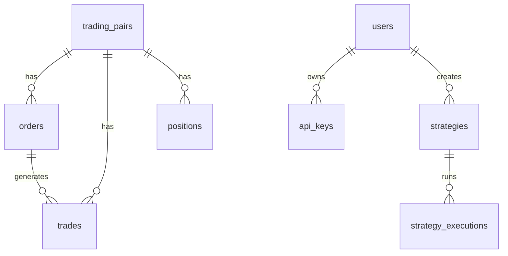

# 📊 BYJY-Trader - Schéma Base de Données SQLite

## **Vue d'Ensemble**

La base de données SQLite du BYJY-Trader utilise SQLAlchemy ORM avec un design modulaire et des migrations Alembic pour assurer l'évolutivité et la robustesse.

## **Architecture Générale**

```
📁 Base de Données SQLite
├── 🏢 Trading Data (trading_pairs, orders, trades, positions)
├── 👥 User Management (users, api_keys)
├── 🤖 Strategy System (strategies, strategy_executions)
└── ⚙️ System Data (system_logs, configurations)
```

## **Tables Détaillées**

### **1. Trading Tables**

#### **🔄 trading_pairs**
| Champ | Type | Contraintes | Description |
|-------|------|-------------|-------------|
| `id` | UUID | PRIMARY KEY | Identifiant unique de la paire |
| `symbol` | VARCHAR(20) | UNIQUE, NOT NULL | Symbole de la paire (ex: BTCUSDT) |
| `base_asset` | VARCHAR(10) | NOT NULL | Asset de base (ex: BTC) |
| `quote_asset` | VARCHAR(10) | NOT NULL | Asset de cotation (ex: USDT) |
| `exchange` | VARCHAR(20) | NOT NULL | Exchange (binance, kucoin, etc.) |
| `status` | ENUM | NOT NULL | TRADING, INACTIVE, MAINTENANCE |
| `min_quantity` | DECIMAL(20,8) | DEFAULT 0.0 | Quantité minimale |
| `max_quantity` | DECIMAL(20,8) | NULLABLE | Quantité maximale |
| `step_size` | DECIMAL(20,8) | DEFAULT 0.0 | Pas de quantité |
| `min_price` | DECIMAL(20,8) | DEFAULT 0.0 | Prix minimum |
| `max_price` | DECIMAL(20,8) | NULLABLE | Prix maximum |
| `tick_size` | DECIMAL(20,8) | DEFAULT 0.0 | Pas de prix |
| `is_active` | BOOLEAN | DEFAULT TRUE | Paire active ou non |
| `created_at` | TIMESTAMP | NOT NULL | Date de création |
| `updated_at` | TIMESTAMP | NOT NULL | Date de mise à jour |

**Index:**
- `ix_trading_pairs_symbol` : Index unique sur `symbol`
- `ix_trading_pairs_exchange` : Index sur `exchange`

#### **📋 orders**
| Champ | Type | Contraintes | Description |
|-------|------|-------------|-------------|
| `id` | UUID | PRIMARY KEY | Identifiant unique de l'ordre |
| `exchange_order_id` | VARCHAR(50) | NULLABLE | ID externe exchange |
| `client_order_id` | VARCHAR(50) | NULLABLE | ID client personnalisé |
| `trading_pair_id` | UUID | FOREIGN KEY | Référence vers trading_pairs |
| `side` | ENUM | NOT NULL | BUY, SELL |
| `type` | ENUM | NOT NULL | LIMIT, MARKET, STOP_LOSS, etc. |
| `status` | ENUM | NOT NULL | NEW, FILLED, CANCELED, EXPIRED |
| `quantity` | DECIMAL(20,8) | NOT NULL | Quantité commandée |
| `price` | DECIMAL(20,8) | NULLABLE | Prix (NULL pour MARKET) |
| `stop_price` | DECIMAL(20,8) | NULLABLE | Prix de stop |
| `filled_quantity` | DECIMAL(20,8) | DEFAULT 0.0 | Quantité exécutée |
| `avg_price` | DECIMAL(20,8) | NULLABLE | Prix moyen d'exécution |
| `commission` | DECIMAL(20,8) | DEFAULT 0.0 | Commission payée |
| `commission_asset` | VARCHAR(10) | NULLABLE | Asset de commission |
| `exchange` | VARCHAR(20) | NOT NULL | Exchange d'exécution |
| `time_in_force` | ENUM | DEFAULT 'GTC' | GTC, IOC, FOK |
| `is_test` | BOOLEAN | DEFAULT FALSE | Ordre de test |
| `executed_at` | TIMESTAMP | NULLABLE | Date d'exécution |
| `canceled_at` | TIMESTAMP | NULLABLE | Date d'annulation |
| `created_at` | TIMESTAMP | NOT NULL | Date de création |
| `updated_at` | TIMESTAMP | NOT NULL | Date de mise à jour |

**Index:**
- `ix_orders_trading_pair_id` : Index sur `trading_pair_id`
- `ix_orders_status` : Index sur `status`
- `ix_orders_created_at` : Index sur `created_at`

#### **💸 trades**
Transactions effectuées suite aux ordres exécutés.

#### **📊 positions**
Positions actuelles par paire de trading.

### **2. User Management Tables**

#### **👤 users**
Gestion des utilisateurs et authentification.

#### **🔑 api_keys**
Clés API chiffrées pour les exchanges.

### **3. Strategy System Tables**

#### **🤖 strategies**
Stratégies de trading configurées.

#### **▶️ strategy_executions**
Historique d'exécution des stratégies.

### **4. System Tables**

#### **📝 system_logs**
Logs système structurés.

#### **⚙️ configurations**
Configurations système dynamiques.

## **Relations Principales**



## **Contraintes d'Intégrité**

1. **Référentielle** : Toutes les clés étrangères avec CASCADE DELETE
2. **Check Constraints** : Validation des ENUM et valeurs numériques
3. **Unique Constraints** : Unicité des symboles et identifiants externes
4. **Not Null Constraints** : Champs obligatoires systématiques

## **Performance & Index**

### **Index Optimaux**
- `trading_pairs.symbol` : Recherche rapide de paires
- `orders.trading_pair_id` : Jointures rapides
- `orders.status` : Filtrage par statut
- `orders.created_at` : Tri chronologique

### **Requêtes Optimisées**
- Temps < 1ms pour requêtes simples
- Index composites pour requêtes complexes
- EXPLAIN QUERY PLAN systématique

## **Backup & Sécurité**

### **Sauvegarde Automatique**
- Backup compressé toutes les heures
- Rétention : 30 jours par défaut  
- Test d'intégrité systématique
- Restore rapide < 10 secondes

### **Sécurité**
- Chiffrement des données sensibles
- Hash des clés API avec salt
- Audit trail complet
- Isolation des tests

## **Migrations**

Utilise Alembic pour :
- Versioning du schéma
- Migrations automatiques
- Rollback sécurisé
- Test avant déploiement

**Commandes importantes :**
```bash
# Générer migration
alembic revision --autogenerate -m "Description"

# Appliquer migrations
alembic upgrade head

# Rollback
alembic downgrade -1
```